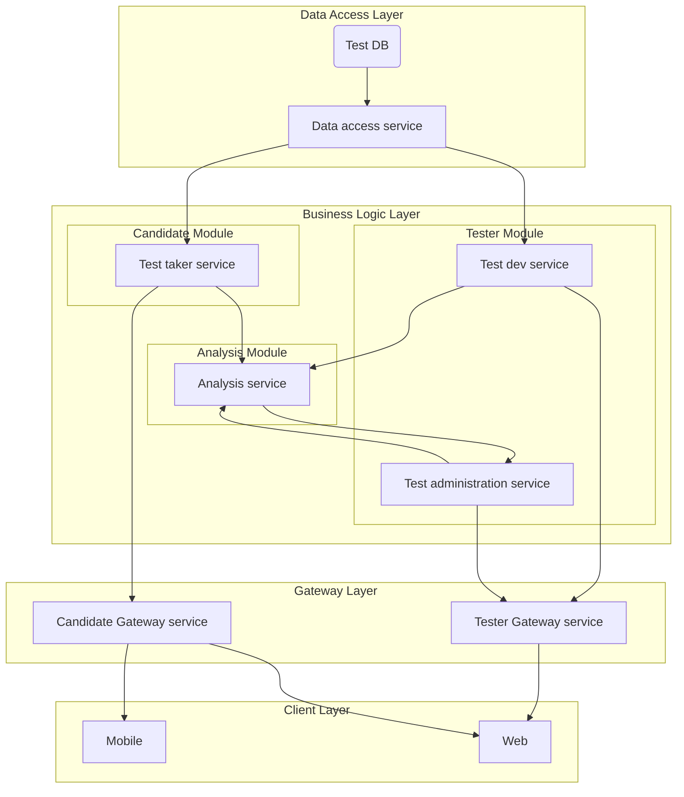

```mermaid
graph TD
  subgraph DAL[Data Access Layer]
    DA(Test DB)-->DB[Data access service]
  end

  subgraph BL[Business Logic Layer]
    subgraph tester[Tester Module]
      TA[Test dev service]
      TB[Test administration service]
    end

    subgraph candidate[Candidate Module]
      CA[Test taker service]
    end

    subgraph analysis[Analysis Module]
      AA[Analysis service]
    end

    TA-->AA
    CA-->AA
    AA-->TB
    TB-->AA

    DB-->TA
    DB-->CA
  end
  
  subgraph GL[Gateway Layer]
    GA[Tester Gateway service]
    GB[Candidate Gateway service]

    TA-->GA
    TB-->GA
    CA-->GB
  end

  subgraph CL[Client Layer]
    FA[Mobile]
    FB[Web]

    GA-->FB
    GB-->FA
    GB-->FB
  end
```
